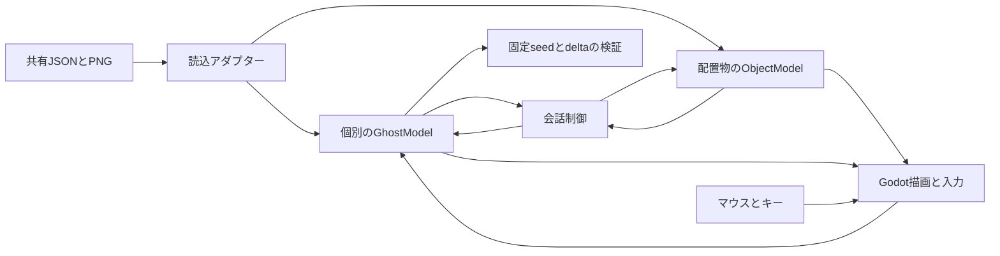
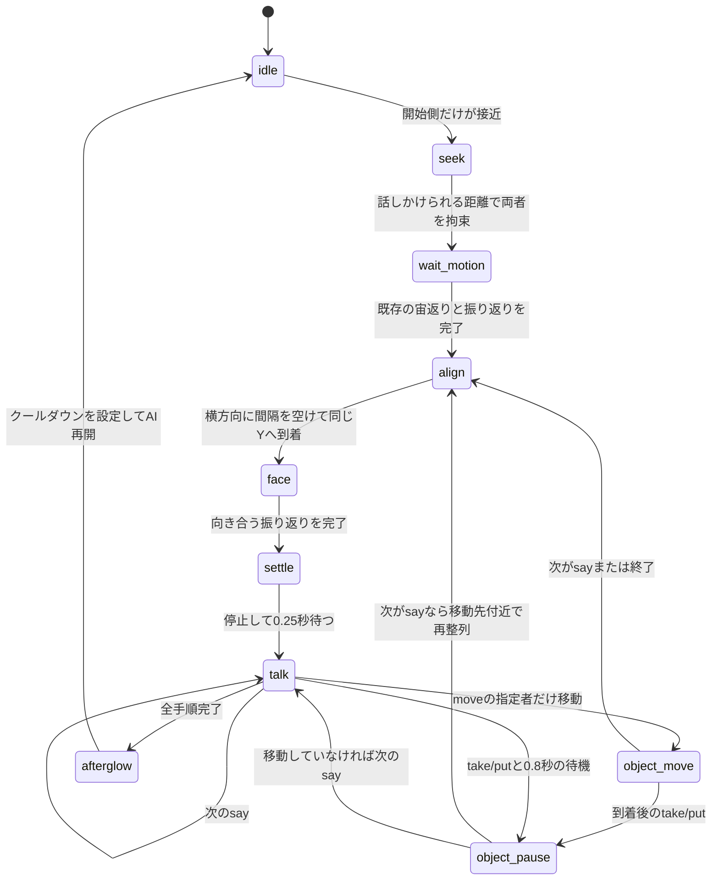

# Godot / GDScript移行: 個別移動・会話・タグ操作

追跡: Issue #54。Python版は参照実装として残し、既存のエディターやデータを変更しない。現在の範囲は通常版の描画・個別移動とsay/move/take/putの会話。専用イベント等は未移植で、移行完了ではない。

## 責務

| 対象 | 責務 | 依存先 |
| --- | --- | --- |
| `godot/scripts/content_loader.gd` | 共有JSONとPNGの読込、初期段階の入力検証 | 通常版の `engine_project.json` / `game_content.json` |
| `godot/scripts/ghost_model.gd` | 乱数、行動選択、移動、旋回、宙返り、クリック目標 | キャラクター定義、表示サイズ、移動範囲、水場。NodeやTexture不要 |
| `godot/scripts/object_model.gd` | 配置物のタグ、初期位置、現在位置、表示状態 | 配置定義。NodeやTexture不要、JSONを書き換えない |
| `godot/scripts/conversation_deck.gd` | 共有会話JSONの検証と対応カードの選別 | say/move/take/put手順、重み。JSONを書き換えない |
| `godot/scripts/conversation_controller.gd` | 接近、回転待ち、横並び整列、発話とタグ操作の順序 | 2匹のモデル、配置物と対応カード。NodeやTexture不要 |
| `godot/scripts/bubble_view.gd` | 日本語の吹き出しと幅に応じた改行 | モデルの発話文字列。行動状態を変更しない |
| `godot/scripts/main.gd` | 描画、入力、ウィンドウ、固定deltaスモーク、ログ | 読込済みデータとモデル |
| `godot/tests/test_runtime.gd` | GDScriptの実挙動テスト | 読込アダプターとモデル |
| `godot/tests/test_conversations.gd` | 会話デッキと姿勢・中断・再開の検証 | デッキ、モデル、コントローラー、会話場面 |
| `godot/tests/test_objects.gd` | タグ操作、到着待ち、再整列、表示状態・中断の検証 | 配置物、デッキ、モデル、シーン |
| `tests/test_godot_runtime.py` | Godot実行テストをPythonのテスト入口に接続 | `GODOT_BIN` またはPATH上の `godot` |

## 共通の挙動

- 左上原点・右がX正・下がY正。内部画面960x540、16:9を維持し全画面時も伸ばさない。
- 透明余白を除いたキャラクター画像を `display_height` に合わせる。まるの元の向きは `native_facing=-1`。
- キャラクターIDと基準seedから各モデルの専用乱数系列を作る。通常起動では時刻から基準seedを変え、`--seed` 指定で固定する。キャラクターの更新順や相手の抽選数に影響されない。Pythonとの乱数列一致は要求しない。
- 行動は停止、前進、高速前進、360度進路変更、大きな移動宙返り、水場での停止と会話への接近。JSONの重みを使う。`seek_talk` は対応会話があり、両者のクールダウンが切れた時だけ候補にする。
- 進路抽選の78%は左右主体。顔の後方へ進む時は0.6秒の振り返りを完了してから動く。壁での反射も同様。
- 浮遊揺れは0.17〜0.29Hzに性格倍率を掛ける。停止中も描画上の上下揺れは継続し、基準位置は動かない。
- 宙返りは5.8〜8.2秒の一周。直進を加えた楕円軌道で進行方向へ離脱する。Godotは時計回りが正なので回転符号はpygameとは逆。空間が足りない時は前進に戻る。
- 左クリックで左右に60pxずつ間隔を取った位置へ寄る。宙返りや振り返りは中断せず完了してから向かい、到着後は通常AIへ戻る。
- F11 / Alt+Enterで全画面切替、Escで終了。共有配置の `visible` を尊重しゲーム機は初期非表示。

## 通常会話

`conversations.json` を直接読み、対応カードを `weight` に比例して抽選する。2回以上の発話も配列順に再生する。旧形式の `kadoka` / `maru` の文字列もsay手順に正規化する。重みは有限の1〜999、話者は `kadoka` / `maru`、発話は非空文字列。不正なカードで起動を止め、共有ファイルは修正しない。

eventを含むカードは未対応のため**カード全体を除外**する。move/take/putに必要な配置タグが欠落するカードも全体を除外する。途中の台詞や取り出しだけを実行しない。起動ログに対応カード数、未移植除外数、タグ欠落除外数を出す。対応カードがゼロなら会話行動を選ばない。現在の共有デッキは23カードが対応、イベント2カードは除外される。

相手は話しかけられるまで通常AIを続ける。受け手が宙返り中でも中断せず完了を待つ。壁付近でも会話距離（標準145px）を維持して横並びにする。発話中は位置・向き・回転角を固定し、描画上の浮遊だけを続ける。1つの発話だけを吹き出しに出して重なりを避ける。日本語システムフォントを使い、長い台詞は250px幅で改行する。

会話終了後は1.2秒の余韻と12〜24秒のクールダウンを置く。接近・整列が25秒以内に完了しなければ解除して通常AIへ戻る。会話中のクリックは会話を中断し、宙返り・振り返りを完了してからクリック地点へ集合する。モデル同士の参照は弱参照にして循環参照を避ける。

## タグ付きオブジェクト操作

配置IDと非空タグは一意にし、曖昧な対象を拒否する。タグなし配置は描画用として許可する。タグはPython版と同様、前後の空白を除き内部の空白を `_` へ変換する。位置・幅は有限、visibleは真偽値。JSON/PNG読込後、描画とは独立したモデルが位置と表示状態を持つ。

| 手順 | 対象と処理 | 次へ進む条件 |
| --- | --- | --- |
| move | actorのkadoka/maru/bothだけを対象タグの位置へ移動。非表示なら初期位置。Yは対象の38px上、bothは左右54pxずつ。移動範囲へクランプ | 全指定者の到着と振り返り完了。25秒で解除 |
| take | 対象を指定者の顔の前方42px・下18pxへ置き表示。bothでも1個を開始側の位置へ置く | 0.8秒の待機 |
| put | 対象を非表示にする。現在位置と初期位置は保存 | 0.8秒の待機 |
| say（move後） | 移動した指定者の到着位置を中心に再整列し、停止して向き合う。次のsayを消費せず待つ | 整列・振り返り完了と0.25秒の待機 |

指定者以外はmove中その場で浮遊し、発話前の再整列で合流する。移動や回転中の吹き出しは消す。take/putは実行中の状態変更で、配置JSONやPNGへ書き戻さない。take後にオブジェクトがキャラクターを追従する機能はなく、Python版と同じく取り出した位置に置く。クリック中断・タイムアウトで移動拘束を解除するが、適用済みの取り出し・収納を巻き戻さない。終了時のゲーム機自動収納は専用イベントを移植する段階で扱う。

## 読込と配布の境界

ソース実行時は `godot/` の親を通常版のコンテンツルートとして読む。PNGやJSONをGodot専用コピーへ分岐させない。`--content-root` で別の通常版ルートを明示できる。

読込アダプターはプロジェクト相対パスだけを許可する。ルート外参照、絶対パス、リンク経由、欠落画像を拒否し、エラーで終了する。Python版のすべての許容入力・エラー条件との一致はまだ対象外。special版は拒否する。Godotの `entrypoint` は `main.tscn` であり、Pythonマニフェストの `game.py` を実行しない。

Godotのエクスポート/PCK単独配布は未対応。今はリポジトリのJSON/PNGが必要。起動コマンドとGodot実行ファイルの指定は [Godot版README](../godot/README.md) を参照。

## 未移植

名前ホバー、水浴び・ゲーム機イベント、粒子・影・ビネット、統合エディター連携、配布構成。システムに日本語フォントがない環境や配布時のフォント同梱は後続対応。

評価ログは10フレームごとに `frame`、`ghosts`（name/x/y/vx/vy/facing/action/turning/spin/target/talk）、`conversation`（phase/initiator/step/completed/movers）、`objects`（id/tag/x/y/visible）をJSONLに記録する。Python版の評価ログとの完全互換ではなく、専用イベント状態は後続段階で追加する。
