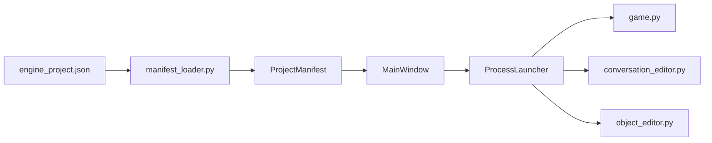

# エンジン化 機能説明書

## 目的

「おばけの住処」専用のゲーム・エディター群から、別作品でも利用できるプロジェクト定義、起動処理、統合GUIを独立させる。

最初のマイルストーンでは既存コードを移動せず、プロジェクト定義JSONを読み込む統合ランチャーを追加する。ゲーム本体と既存エディターの挙動は変えない。

## 第1マイルストーンの範囲

| 項目 | 内容 |
| --- | --- |
| プロジェクト定義 | ゲーム名、実行ファイル、エディター、データ場所をJSONで記述する |
| データ層 | JSONを検証し、パスをプロジェクト内へ制限して読み込む |
| 処理層 | ゲームまたは選択したエディターを別プロセスで起動する |
| GUI層 | 利用可能な機能を定義JSONからボタンとして表示する |
| 互換性 | `game.py`、`conversation_editor.py`、`object_editor.py` は変更せず利用する |
| 検証 | 定義読込、パス制限、重複ID、起動コマンドを単体テストする |

## 構成



| 区分 | ファイル | 責務 |
| --- | --- | --- |
| データ | `engine/editor_definition.py` | エディター1件の定義 |
| データ | `engine/project_manifest.py` | 読み込んだプロジェクト全体の定義 |
| 処理 | `engine/manifest_loader.py` | JSON読込と検証 |
| 処理 | `engine/process_launcher.py` | Pythonスクリプトの起動 |
| GUI | `engine/main_window.py` | 統合ランチャー画面 |
| 起動 | `engine_app.py` | 引数処理と各層の組み立て |

## プロジェクト定義

```json
{
  "schema_version": 1,
  "name": "おばけの住処",
  "entrypoint": "game.py",
  "editors": [
    {
      "id": "conversation_event",
      "label": "会話・イベントエディター",
      "script": "conversation_editor.py"
    }
  ],
  "content": {
    "characters": "assets",
    "room": "placed_objects.json"
  }
}
```

- パスは定義JSONのあるフォルダーからの相対パスとする。
- `..` などでプロジェクト外を参照する定義は拒否する。
- エディターIDはプロジェクト内で重複不可とする。
- 実行ファイル、エディター、コンテンツ参照先は起動前に存在確認する。

## 今後のマイルストーン

1. キャラクター定義とキャラクターエディターを独立させる。
2. 部屋データと描画設定を `game.py` から分離する。
3. オブジェクト、会話、イベントのデータ処理をGUIから分離する。
4. エンジンから新規プロジェクトを作成できるようにする。
5. エンジン側からプロジェクトを選択して編集・実行できるようにする。
6. `obakeno_sumika_special` は別プロジェクト・別テスト環境として扱う。

エンジン化全体が完了するまで `docs/開発予定.md` の「エンジン化」は削除しない。
