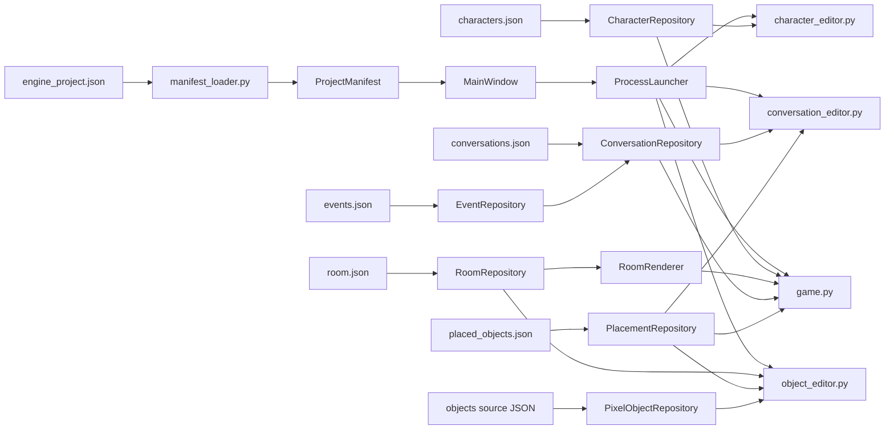
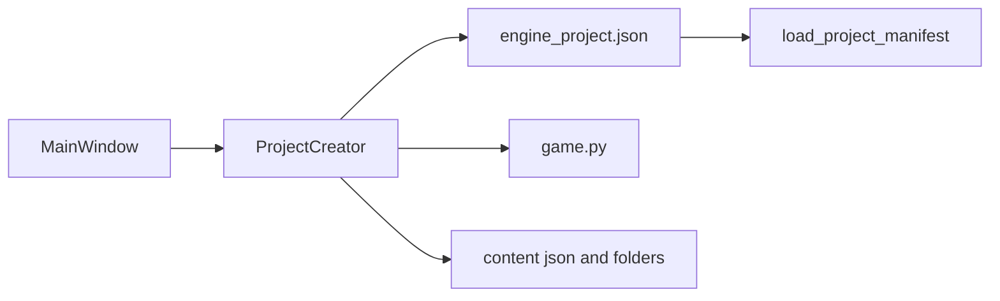
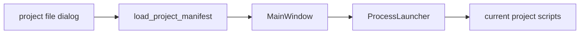

# エンジン化 機能説明書

## 目的

「おばけの住処」専用のゲーム・エディター群から、別作品でも利用できるプロジェクト定義、起動処理、統合GUIを独立させる。

最初のマイルストーンでは既存コードを移動せず、プロジェクト定義JSONを読み込む統合ランチャーを追加する。ゲーム本体と既存エディターの挙動は変えない。

## 第1マイルストーンの範囲

| 項目 | 内容 |
| --- | --- |
| プロジェクト定義 | ゲーム名、実行ファイル、エディター、データ場所をJSONで記述する |
| データ層 | JSONを検証し、パスをプロジェクト内へ制限して読み込む |
| 処理層 | ゲームまたは選択したエディターを別プロセスで起動する |
| GUI層 | 利用可能な機能を定義JSONからボタンとして表示する |
| 互換性 | `game.py`、`conversation_editor.py`、`object_editor.py` は変更せず利用する |
| 検証 | 定義読込、パス制限、重複ID、起動コマンドを単体テストする |

## 構成



| 区分 | ファイル | 責務 |
| --- | --- | --- |
| データ | `engine/editor_definition.py` | エディター1件の定義 |
| データ | `engine/project_manifest.py` | 読み込んだプロジェクト全体の定義 |
| 処理 | `engine/manifest_loader.py` | JSON読込と検証 |
| 処理 | `engine/process_launcher.py` | Pythonスクリプトの起動 |
| 処理 | `engine/project_creator.py` | 新規プロジェクトの最小テンプレート生成 |
| GUI | `engine/main_window.py` | 統合ランチャー画面 |
| 起動 | `engine_app.py` | 引数処理と各層の組み立て |
| データ | `engine/character_definition.py` | キャラクター1件の検証済み設定 |
| 処理 | `engine/character_repository.py` | キャラクターJSONの読込、検証、保存 |
| GUI | `character_editor.py` | キャラクター設定の編集と画像プレビュー |
| データ | `engine/room_definition.py` | 部屋寸法、領域、背景レイヤーの検証済み設定 |
| 処理 | `engine/room_repository.py` | 部屋JSONの読込と検証 |
| 描画 | `engine/room_renderer.py` | 部屋定義から静的背景を生成 |
| データ | `engine/conversation_definition.py` | 重み付き会話手順1件の定義 |
| 処理 | `engine/conversation_repository.py` | 会話の旧形式変換、正規化、原子的保存 |
| データ | `engine/event_definition.py` | イベントID、表示名、必要タグの定義 |
| 処理 | `engine/event_repository.py` | イベントカタログと必要タグの検証 |
| データ | `engine/placement_definition.py` | 配置物1件の検証済み設定 |
| 処理 | `engine/placement_repository.py` | 配置JSON、タグ、プロジェクト内パスの検証と保存 |
| 処理 | `engine/pixel_object_repository.py` | ドット絵ソースと1024px透過PNGの読込・保存 |

## プロジェクト定義

```json
{
  "schema_version": 1,
  "name": "おばけの住処",
  "entrypoint": "game.py",
  "editors": [
    {
      "id": "character",
      "label": "キャラクターエディター",
      "script": "character_editor.py"
    },
    {
      "id": "conversation_event",
      "label": "会話・イベントエディター",
      "script": "conversation_editor.py"
    }
  ],
  "content": {
    "characters": "characters.json",
    "room": "room.json",
    "placements": "placed_objects.json"
  }
}
```

- パスは定義JSONのあるフォルダーからの相対パスとする。
- `..` などでプロジェクト外を参照する定義は拒否する。
- エディターIDはプロジェクト内で重複不可とする。
- 実行ファイル、エディター、コンテンツ参照先は起動前に存在確認する。

## 第2マイルストーン: キャラクター定義

ゲーム内に直接書かれていた、かどかとまるの表示設定を `characters.json` へ分離する。ゲームとキャラクターエディターは `CharacterRepository` を共有し、中間形式を作らず同じJSONを読む。

| 項目 | 用途 | 範囲 |
| --- | --- | --- |
| `id` | 会話・イベントが参照する固定ID | 空文字・重複不可 |
| `display_name` | マウスを重ねたときの表示名 | 空文字不可 |
| `image` | 透過キャラクター画像 | プロジェクト内の既存ファイル |
| `start_position` | 起動時の中心X、Y | 960×540の画面内 |
| `display_height` | ゲーム内の表示身長 | 16～256 px |
| `personality` | 通常速度と浮遊周期の倍率 | 0.25～3.0 |
| `native_facing` | 元画像の前方 | `1` または `-1` |
| `bubble_y_offset` | 会話吹き出しの縦補正 | -200～200 px |

現在の「おばけの住処」は会話イベントの契約上、`kadoka` と `maru` の2件を必要とする。汎用の保存処理は複数キャラクターを扱えるが、現在のゲーム側はこの2IDを明示的に検証する。

## 第3マイルストーン: 部屋データと描画

`game.py` に直接書かれていた部屋寸法、行動領域、背景形状、環境粒子設定を `room.json` へ分離する。`RoomRepository` がJSONを検証し、`RoomRenderer` が背景を描画する。ゲームとオブジェクトエディターは同じ部屋寸法を参照する。

| 区分 | 主な設定 | 用途 |
| --- | --- | --- |
| 基本 | `size`、`fps` | 16:9の内部解像度と更新頻度 |
| 行動 | `movement_bounds`、`zones.water_rest` | おばけの移動範囲と水場休憩領域 |
| 会話 | `conversation_distance` | 会話へ接近できる距離 |
| 環境 | `motes` | ほこりの個数、発生範囲、再配置範囲 |
| 背景 | `gradient`、`polygons`、`vignette` | 奥壁、洞窟形状、床、周辺暗転 |

背景ポリゴンは記述順に重ねる。第3マイルストーンでは従来座標をそのまま移し、分離前後のスクリーンショットが画素単位で一致することを検証する。

## 第4マイルストーン: コンテンツデータ処理

ゲーム、会話エディター、オブジェクトエディターに重複していたJSON処理を共通層へ移す。GUIは入力と表示だけを担当し、読込、旧形式変換、検証、保存は各リポジトリが担当する。

| リポジトリ | 入出力 | 主な検証 |
| --- | --- | --- |
| `ConversationRepository` | `conversations.json` | 話者、動作者、手順、イベントID、重み1～999 |
| `EventRepository` | `events.json` | ID重複、表示名、終了属性、必要タグ |
| `PlacementRepository` | `placed_objects.json` | ID・タグ重複、座標、幅、画像パス |
| `PixelObjectRepository` | `*.source.json`、PNG | キャンバス寸法、行列サイズ、`#RRGGBB`、1024px出力 |

保存は一時ファイルを作ってから置換する。ゲームとエディターは同じリポジトリを使用し、イベントが要求するタグと実際の配置タグも起動時に照合する。

## 今後のマイルストーン

1. `obakeno_sumika_special` は別プロジェクト・別テスト環境として扱う。

## 第5マイルストーン: 新規プロジェクト作成

エンジンランチャーからプロジェクト名と作成先フォルダーを選び、汎用の最小プロジェクトを生成できるようにする。生成直後の `engine_project.json` は既存のマニフェスト検証に通る。

| 生成物 | 内容 |
| --- | --- |
| `engine_project.json` | プロジェクト名、`game.py`、各コンテンツJSON/フォルダーへの相対パス |
| `game.py` | `room.json` と `assets/player.png` を使う最小pygame実行ファイル |
| `room.json` | 960x540、60fps、最小背景と移動領域 |
| `characters.json` | `player` 1件とプレースホルダー画像 |
| `events.json` | 空のイベントカタログを避けるための `idle` イベント |
| `conversations.json` | `player` の短い初期会話 |
| `placed_objects.json` | 空の配置リスト |
| `assets/`、`objects/` | 画像とドット絵ソースの置き場 |



## 第6マイルストーン: プロジェクト選択と実行

エンジンランチャーから任意の `engine_project.json` を選択し、そのプロジェクトのゲーム・エディターを実行できるようにする。新規作成後も作成したプロジェクトへ自動的に切り替える。

| 操作 | 挙動 |
| --- | --- |
| プロジェクトを開く | ファイル選択で `engine_project.json` を読み込み、ランチャーの表示と起動対象を差し替える |
| ゲームを実行 | 現在開いているプロジェクトの `entrypoint` を、そのプロジェクトのフォルダーを作業ディレクトリとして起動する |
| エディターを実行 | 現在開いているプロジェクトの `editors` にあるスクリプトだけをボタン化して起動する |
| 新規作成後 | 生成したプロジェクトをすぐ現在のプロジェクトとして開く |



エンジン化全体が完了するまで `docs/開発予定.md` の「エンジン化」は削除しない。
