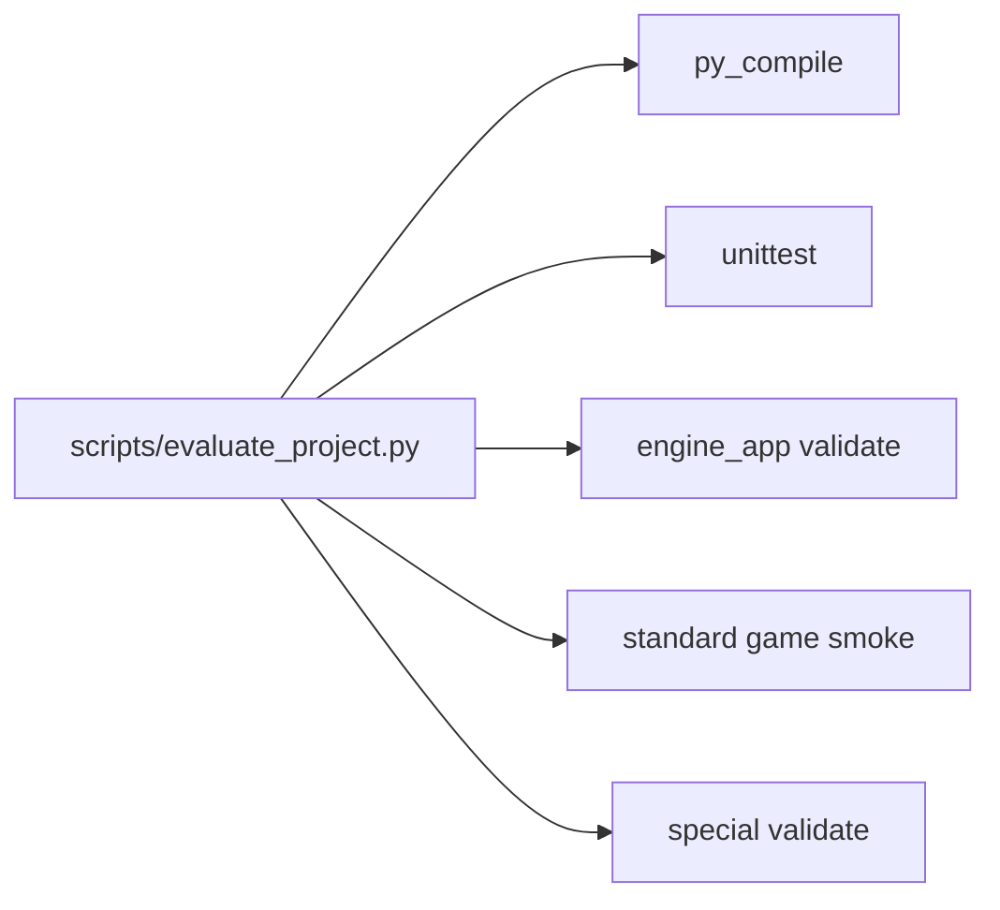

# 自動評価システム 機能説明書

## 目的

通常版、エンジン、special版の最低限の健全性を1コマンドで確認できるようにする。手作業で複数コマンドを打つ負担を減らし、GitHubへアップロードする前の確認漏れを防ぐ。

## 評価内容

| 項目 | コマンド | 確認内容 |
| --- | --- | --- |
| 構文チェック | `python -m py_compile ...` | 仮想環境とキャッシュを除くPythonファイルが構文エラーを起こさない |
| 単体テスト | `python -m unittest discover -s tests -v` | 既存の回帰テストがすべて通る |
| エンジン検証 | `python engine_app.py --validate` | 通常版マニフェストが読める |
| 通常版スモーク | `python game.py --test-frames 900 --seed 12345` | ダミー表示で通常版が一定フレーム動く |
| special版検証 | `python projects/obakeno_sumika_special/game.py --validate` | special版の分離プロジェクトが読める |

## 構成



## 起動

```powershell
.\.venv\Scripts\python.exe scripts\evaluate_project.py
```

短時間確認にする場合:

```powershell
.\.venv\Scripts\python.exe scripts\evaluate_project.py --frames 60
```
